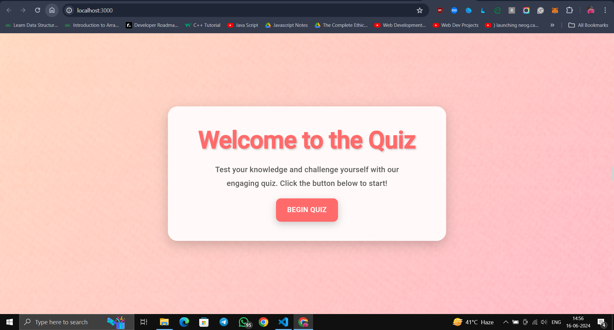
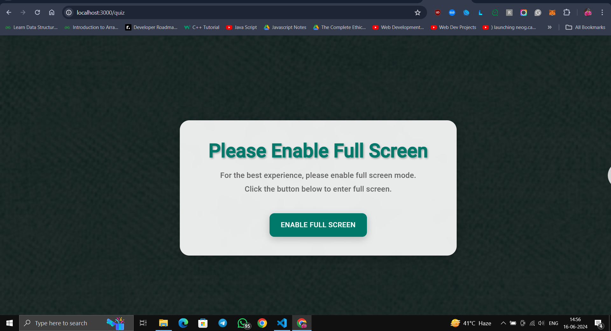

# 📝✨ Quiz Assignment 🎉

Welcome to the **Quiz Assignment** project! This interactive and fun quiz application ensures you stay on your toes with a 10-minute timer and persistent state-saving features. Built with React.js, this quiz offers a seamless experience with localStorage support to resume where you left off! 🚀

## 🎥 Demo

[Watch the Demo](assets/quiz.gif)




## 🌟 Live Demo

Check out the live demo of the project deployed on Vercel: [Quiz Assignment Live Demo](https://your-vercel-deployment-link.vercel.app)

## ✨ Features

- 🎯 **Quiz from JSON**: Dynamically loads quiz questions and answers from a JSON file.
- 📺 **Full Screen Mode**: The quiz can only be taken in full screen mode for an immersive experience.
- 🔢 **10 Questions**: Features 10 engaging multiple-choice questions.
- 💾 **State Persistence**: Resume your quiz from the last answered question even after refreshing the page.
- ⏲️ **Timer**: A 10-minute timer is provided to complete the quiz, ensuring you stay on track.
- 📊 **Multiple Choice**: Each question comes with multiple choices to select from.
- 🚫 **Full Screen Enforcement**: A prompt ensures you enable full screen mode before taking the quiz.



## 🚀 Getting Started

### Prerequisites

Make sure you have Node.js and npm installed on your machine.

### Installation

1. **Clone the repository**:
    ```bash
    git clone https://github.com/your-username/quiz-assignment.git
    cd quiz-assignment
    ```

2. **Install dependencies**:
    ```bash
    npm install
    ```

3. **Start the development server**:
    ```bash
    npm start
    ```

4. **Open your browser** and navigate to [http://localhost:3000](http://localhost:3000)


## 🛠️ Available Scripts

In the project directory, you can run:

- `npm start`: Runs the app in development mode. Open [http://localhost:3000](http://localhost:3000) to view it in your browser.
- `npm test`: Launches the test runner in the interactive watch mode.
- `npm run build`: Builds the app for production to the `build` folder.
- `npm run eject`: Ejects the build configuration and dependencies for customization.

## 🌐 Deployment

Deploy this project using Vercel or any other static site hosting service. For detailed steps, refer to the [Create React App deployment guide](https://facebook.github.io/create-react-app/docs/deployment).

## 📷 Screenshots

Here's a sneak peek into the app:


## 📚 Learn More

- [Create React App Documentation](https://facebook.github.io/create-react-app/docs/getting-started)
- [React Documentation](https://reactjs.org/)

## 🚀 Advanced Configuration

For advanced configuration and customization, refer to the [Create React App documentation](https://facebook.github.io/create-react-app/docs/advanced-configuration).

## ⚠️ Troubleshooting

If you encounter any issues, please refer to the [troubleshooting guide](https://facebook.github.io/create-react-app/docs/troubleshooting#npm-run-build-fails-to-minify).


---

Feel free to explore the code and improve it as per your needs! If you have any questions or suggestions, please open an issue or submit a pull request. Your contributions are highly appreciated! 🌟

Happy coding! 🚀

--

You can replace the placeholders (like `https://your-vercel-deployment-link.vercel.app`) with the actual links and update image paths accordingly. This `README.md` should now be more engaging and informative for your GitHub repository.